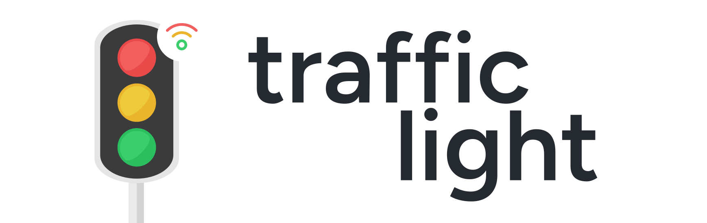
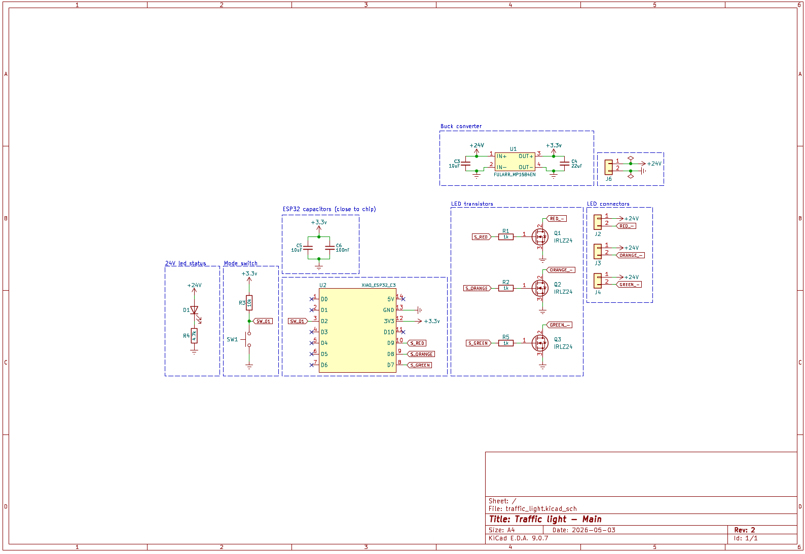
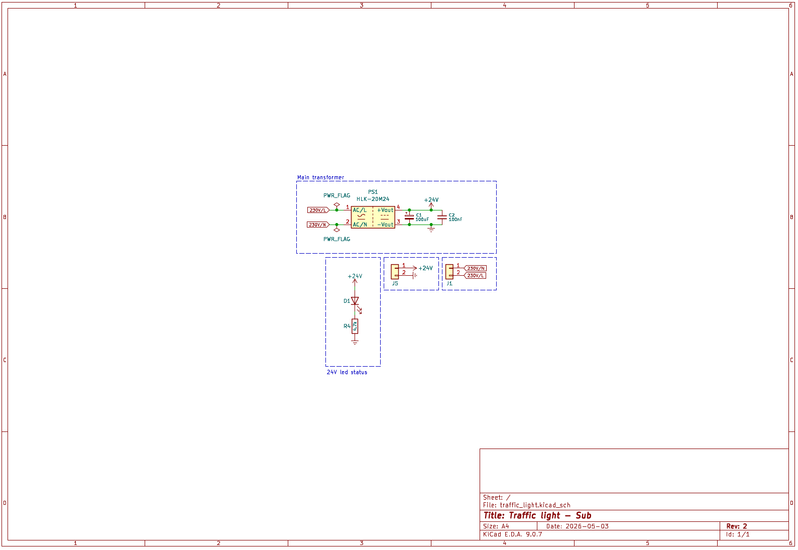
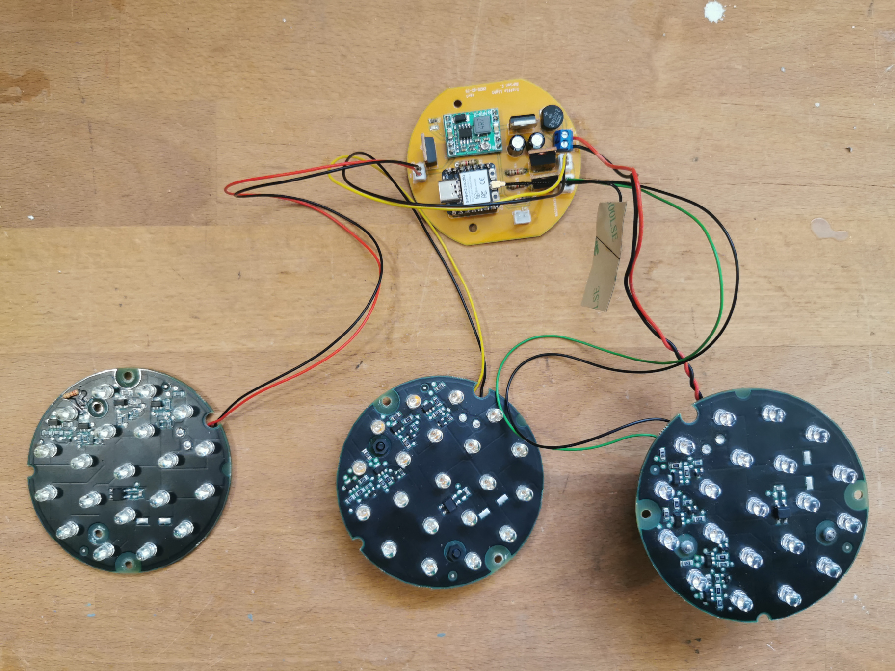
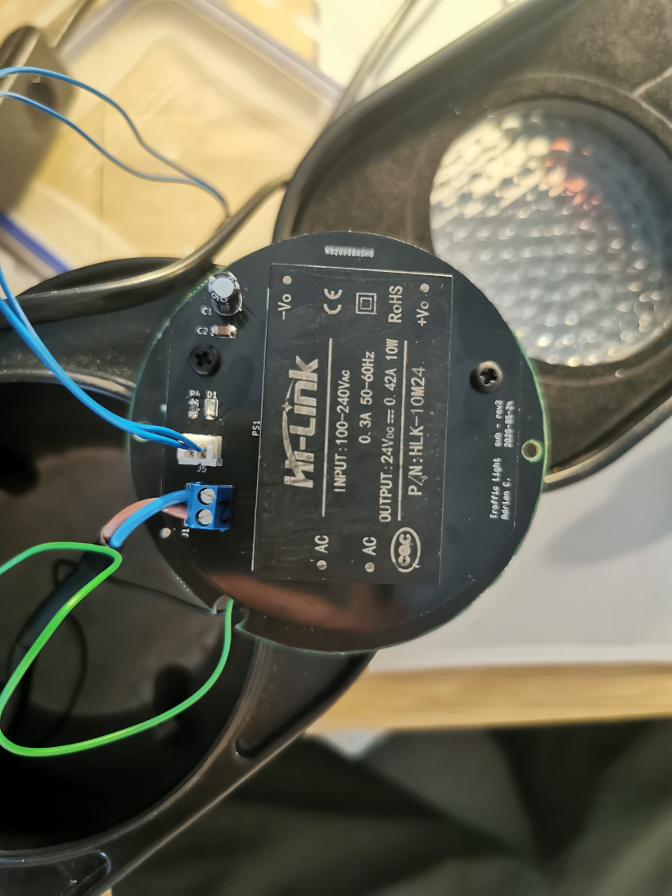
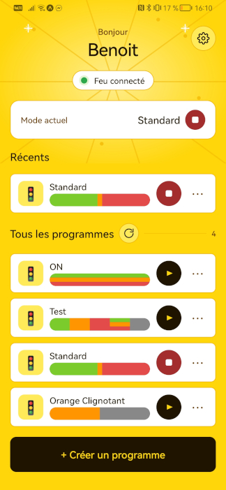
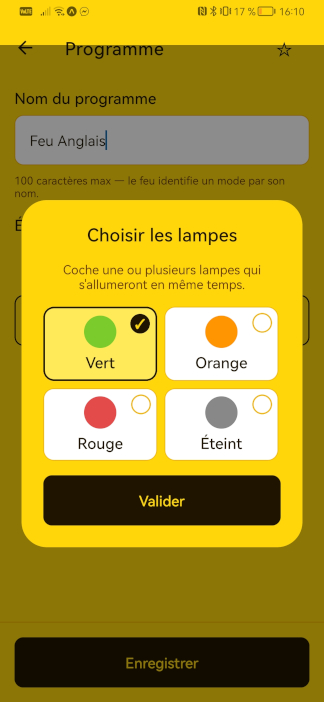
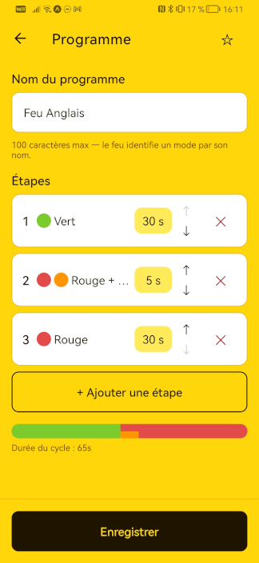

# Traffic Light 🚦



An **ESP32-C3**-powered controller that brings a salvaged **SAGEM pedestrian traffic light** back to life over Wi-Fi.

The firmware drives the three led boards (green / orange / red) through user-defined **modes** — named, looping sequences of timed steps — and exposes a small **binary HTTP API** so a companion mobile app can list, create, edit, play, and delete modes on the device.

## ✨ Features

- Built with **ESP-IDF** on the **ESP32-C3**
- Drives green / orange / red lamps directly from GPIOs
- **Modes** = named, looping sequences of steps (lamp mask + duration in ms)
- Built-in standard modes: `all_leds`, `test_leds`, `standard`, `blinking_orange`
- Compact **binary HTTP API** (full spec in [`main/http/description.md`](main/http/description.md)):
  - `GET /version` — firmware version, length-prefixed binary
  - `GET /version_json` — full firmware identity as JSON
  - `GET /get_modes` — every stored mode
  - `GET /get_mode` — the currently active mode
  - `POST /command` — `set` / `add` / `custom` / `delete` / `edit` a mode
- Physical **push-button** for local control (short / long press)
- Wi-Fi **station** with SSID / password set via `menuconfig`
- Firmware **version reporting** from `git describe`
- Clean **task-based architecture** (HTTP handler / mode manager / LED driver)
- Companion **React Native (Expo) app** for full control from your phone

## 🙌 Sponsor

Huge thanks to **PCBWay** for sponsoring the PCB manufacturing for this project.
Their support, help and advices helped make this project physically real.

If you're looking for high-quality PCB fabrication or assembly services, check them out:

👉 https://www.pcbway.com


## 🖼 Schematics & PCB








> ⚠️ The lamps run on 230V AC — keep the mains side properly isolated, spaced, and enclosed.

## 🔌 Configuration

The project use kconfig style configuration at build time. Use `make menuconfig` to configure Wi-Fi settings, GPIOs, etc.

## Build and flash

A `Makefile` wraps `idf.py` and regenerates the version header (from `git describe`) on every build:

```bash
make build
make flash PORT=/dev/ttyACM0
make flash-monitor PORT=/dev/ttyACM0
```

Or the raw IDF commands:

```bash
# Activate ESP-IDF environment
. $IDF_PATH/export.sh

idf.py set-target esp32c3
idf.py menuconfig
idf.py build flash monitor
```

## Mobile App





*Made with ☕ and lots of light in the eyes.*
